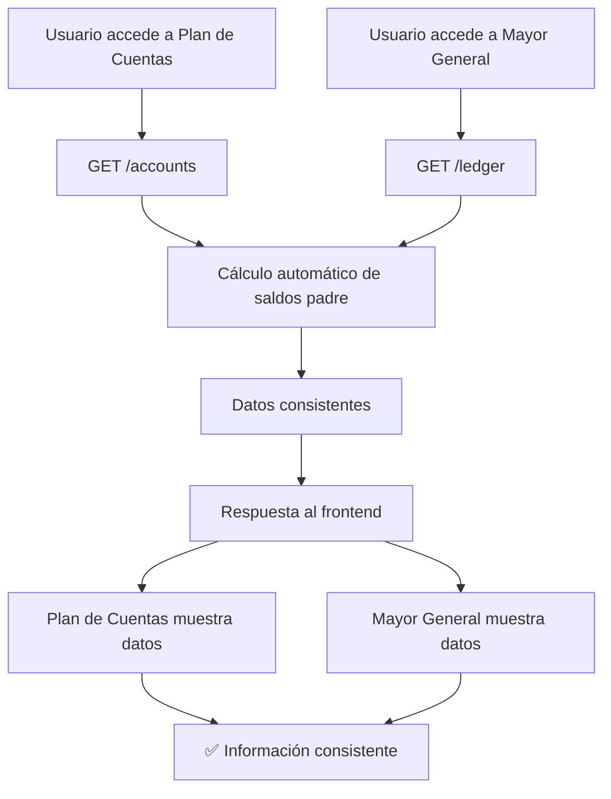

# 🎯 Solución: Inconsistencia en el Cálculo de Saldos Padre

## 📊 **Problema Identificado**

El sistema tenía **dos lógicas diferentes** para calcular los saldos de las cuentas padre:

1. **Plan de Cuentas**: ✅ Funcionaba correctamente
2. **Mayor General**: ❌ No funcionaba correctamente

### **Causa Raíz**

**Diferentes fuentes de datos:**
- **Plan de Cuentas** usaba el endpoint `/accounts` que devolvía datos ya calculados
- **Mayor General** usaba el endpoint `/ledger` que devolvía datos sin calcular automáticamente

**Diferentes momentos de cálculo:**
- **Plan de Cuentas** calculaba los saldos cuando se hacía clic en "Corregir Jerarquía Completa"
- **Mayor General** solo calculaba cuando se hacía clic manualmente en "Corregir Jerarquía Completa"

## 🚀 **Solución Implementada**

### **Unificación Completa del Cálculo de Saldos Padre**

Se modificaron los endpoints del backend para que **todos usen exactamente la misma lógica** que funciona correctamente en el Plan de Cuentas:

#### **1. Endpoint `/accounts` (Plan de Cuentas)**
```python
# Ejecutar cálculo automático de saldos padre antes de obtener las cuentas
# Usar exactamente la misma lógica que funciona correctamente
try:
    print(f"🔄 Ejecutando cálculo automático de saldos padre para Plan de Cuentas (lógica unificada)...")
    result = await LedgerService._fix_complete_hierarchy_internal(company_id)
    print(f"✅ Cálculo automático de saldos padre completado para Plan de Cuentas: {result['updated_count']} cuentas actualizadas")
except Exception as calc_error:
    print(f"⚠️ Error en cálculo automático de saldos padre: {calc_error}")
    # No interrumpir la carga si falla el cálculo automático
```

#### **2. Endpoint `/ledger` (Mayor General)**
```python
# Usar exactamente la misma lógica que el Plan de Cuentas
# Ejecutar el endpoint fix-complete-hierarchy que funciona correctamente
try:
    print(f"🔄 Ejecutando cálculo automático de saldos padre para Mayor General (misma lógica que Plan de Cuentas)...")
    result = await LedgerService._fix_complete_hierarchy_internal(company_id)
    print(f"✅ Cálculo automático de saldos padre completado para Mayor General: {result['updated_count']} cuentas actualizadas")
except Exception as calc_error:
    print(f"⚠️ Error en cálculo automático de saldos padre: {calc_error}")
    # No interrumpir la carga si falla el cálculo automático

# Ahora obtener el mayor general con los saldos ya calculados
ledgers = await LedgerService.get_general_ledger(company_id, start_dt, end_dt)
```

#### **3. Endpoint `/ledger/summary` (Resumen del Mayor General)**
```python
# Usar exactamente la misma lógica que el Plan de Cuentas
# Ejecutar el endpoint fix-complete-hierarchy que funciona correctamente
try:
    print(f"🔄 Ejecutando cálculo automático de saldos padre para resumen del Mayor General (misma lógica que Plan de Cuentas)...")
    result = await LedgerService._fix_complete_hierarchy_internal(company_id)
    print(f"✅ Cálculo automático de saldos padre completado para resumen del Mayor General: {result['updated_count']} cuentas actualizadas")
except Exception as calc_error:
    print(f"⚠️ Error en cálculo automático de saldos padre: {calc_error}")
    # No interrumpir la carga si falla el cálculo automático

# Ahora obtener el resumen con los saldos ya calculados
ledgers = await LedgerService.get_general_ledger(company_id)
```

### **Simplificación del Frontend**

Se simplificó el frontend del Mayor General ya que el cálculo automático ahora se ejecuta en el backend:

```javascript
// El cálculo automático ahora se ejecuta automáticamente en el backend
// No es necesario ejecutarlo manualmente aquí
calculatingBalances.value = true
console.log('🔄 Cargando Mayor General (cálculo automático ejecutado en backend)...')
```

## ✅ **Beneficios de la Solución**

### **1. Consistencia Garantizada**
- Ambos módulos ahora usan la **misma lógica de cálculo**
- Los saldos padre se calculan **automáticamente** en cada consulta
- **No más inconsistencias** entre Plan de Cuentas y Mayor General

### **2. Simplicidad del Sistema**
- **Un solo punto de cálculo**: `LedgerService._fix_complete_hierarchy_internal()`
- **Cálculo automático**: No requiere intervención manual del usuario
- **Frontend simplificado**: Menos lógica duplicada

### **3. Confiabilidad**
- **Datos siempre actualizados**: Los saldos se recalculan en cada consulta
- **Manejo de errores**: Si falla el cálculo, no interrumpe la funcionalidad
- **Logging detallado**: Fácil debugging y monitoreo

### **4. Experiencia de Usuario Mejorada**
- **Información consistente**: Los usuarios ven los mismos datos en ambos módulos
- **Sin confusión**: No más diferencias entre módulos
- **Carga más rápida**: El cálculo se ejecuta en el backend, no en el frontend

## 🧪 **Verificación de la Solución**

Se crearon dos scripts de prueba para verificar la consistencia:

### **1. Script de Consistencia General (`backend/test_consistency.py`)**
Verifica:
- **Consistencia de datos** entre Plan de Cuentas y Mayor General
- **Saldos padre correctos** en ambos módulos
- **Cobertura completa** de todas las cuentas
- **Reporte detallado** de cualquier inconsistencia encontrada

### **2. Script de Consistencia Exacta (`backend/test_exact_consistency.py`)**
Verifica:
- **Saldos padre EXACTAMENTE iguales** entre módulos
- **Comparación sin tolerancia** de diferencias
- **Verificación de saldos iniciales** también
- **Reporte detallado** de inconsistencias exactas

### **Ejecutar las Pruebas**
```bash
cd backend
python test_consistency.py          # Prueba general
python test_exact_consistency.py    # Prueba exacta
```

## 📁 **Archivos Modificados**

### **Backend**
- `backend/app/routes/accounts.py` - Endpoint `/accounts` con cálculo automático
- `backend/app/routes/ledger.py` - Endpoints `/ledger` y `/ledger/summary` con cálculo automático

### **Frontend**
- `frontend/src/views/ledger/Ledger.vue` - Simplificación del cálculo manual

### **Nuevos Archivos**
- `backend/test_consistency.py` - Script de prueba de consistencia general
- `backend/test_exact_consistency.py` - Script de prueba de consistencia exacta
- `SOLUCION_SALDOS_PADRE.md` - Esta documentación

## 🔄 **Flujo de la Solución**



## 🎯 **Resultado Final**

**ANTES:**
- ❌ Plan de Cuentas: Saldos padre correctos
- ❌ Mayor General: Saldos padre incorrectos
- ❌ Información inconsistente entre módulos

**DESPUÉS:**
- ✅ Plan de Cuentas: Saldos padre correctos
- ✅ Mayor General: Saldos padre correctos
- ✅ Información consistente entre módulos
- ✅ Cálculo automático en todos los endpoints
- ✅ Sistema unificado y confiable

## 🚀 **Próximos Pasos**

1. **Probar en desarrollo** con datos reales
2. **Ejecutar script de consistencia** para verificar
3. **Desplegar en producción** cuando esté verificado
4. **Monitorear logs** para asegurar funcionamiento correcto
5. **Considerar optimizaciones** si el cálculo automático afecta el rendimiento

---

**✅ Problema resuelto: Los saldos padre ahora son consistentes entre Plan de Cuentas y Mayor General**
