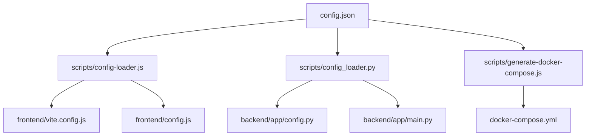

# 🔧 Configuración Centralizada - Sistema Contable

Este sistema ahora utiliza una configuración centralizada que permite cambiar fácilmente los puertos del frontend y backend desde un solo archivo.

## 📁 Archivos de Configuración

### `config.json` (Archivo Principal)
Contiene toda la configuración de puertos y hosts para development y production:

```json
{
  "development": {
    "frontend": {
      "port": 5173,
      "host": "0.0.0.0",
      "allowedHosts": ["accescontserver.sytes.net", "localhost", "127.0.0.1"]
    },
    "backend": {
      "port": 8000,
      "host": "0.0.0.0",
      "ip": "localhost",
      "protocol": "http"
    },
    "database": {
      "port": 27017,
      "host": "localhost"
    }
  },
  "production": {
    "frontend": {
      "port": 80,
      "host": "0.0.0.0",
      "allowedHosts": ["accescontserver.sytes.net"]
    },
    "backend": {
      "port": 8000,
      "host": "0.0.0.0",
      "ip": "localhost",
      "protocol": "http"
    },
    "database": {
      "port": 27017,
      "host": "mongodb"
    }
  }
}
```

> **🔄 IP Dinámica**: El sistema ahora detecta automáticamente la IP del equipo donde se ejecuta y la actualiza en la configuración. No es necesario configurar manualmente la IP.

## 🚀 Cómo Cambiar los Puertos

### Opción 1: Script Automático (Recomendado)

```bash
# Cambiar frontend a puerto 5174 y backend a 8001
# La IP se detecta automáticamente
node scripts/change-ports.js 5174 8001

# Cambiar solo el frontend a puerto 5174
node scripts/change-ports.js 5174

# Cambiar solo el backend a puerto 8001
node scripts/change-ports.js -- 8001

# Ver configuración actual (incluye IP detectada)
node scripts/change-ports.js --show

# Regenerar docker-compose.yml
node scripts/change-ports.js --regenerate-docker

# Inicializar configuración con IP actual del equipo
node scripts/init-config.js
```

> **🌐 Detección Automática de IP**: Cuando ejecutas `change-ports.js`, el sistema detecta automáticamente la IP del equipo y la actualiza en la configuración. No necesitas configurar manualmente la IP.

### Opción 2: Edición Manual

1. Edita el archivo `config.json`
2. Cambia los puertos en las secciones `development` y `production`
3. Ejecuta: `node scripts/generate-docker-compose.js`

## 📋 Archivos Afectados

Cuando cambies la configuración, estos archivos se actualizan automáticamente:

- ✅ `frontend/vite.config.js` - Configuración de Vite
- ✅ `frontend/config.js` - Configuración del frontend
- ✅ `backend/app/config.py` - Configuración del backend
- ✅ `backend/app/main.py` - Puerto del servidor backend
- ✅ `docker-compose.yml` - Configuración de Docker

## 🔄 Flujo de Configuración



## 🛠️ Scripts Disponibles

### `scripts/change-ports.js`
Script principal para cambiar puertos y regenerar configuración. **Detecta automáticamente la IP del equipo**.

### `scripts/init-config.js`
Script para inicializar la configuración con la IP actual del equipo. Útil para configurar el sistema por primera vez.

### `scripts/generate-docker-compose.js`
Genera el archivo `docker-compose.yml` basado en la configuración centralizada.

### `scripts/config-loader.js`
Cargador de configuración para el frontend (JavaScript/Node.js).

### `scripts/config_loader.py`
Cargador de configuración para el backend (Python).

## 📝 Ejemplos de Uso

### Cambiar Frontend de 5173 a 5174 y Backend de 8000 a 8001

```bash
# 1. Cambiar configuración (IP se detecta automáticamente)
node scripts/change-ports.js 5174 8001

# 2. Reiniciar servicios
# Frontend
cd frontend && npm run dev

# Backend
cd backend && python run.py
```

### Inicializar Configuración por Primera Vez

```bash
# 1. Inicializar con IP actual del equipo
node scripts/init-config.js

# 2. Cambiar puertos si es necesario
node scripts/change-ports.js 5174 8001

# 3. Iniciar servicios
cd frontend && npm run dev
cd backend && python run.py
```

### Cambiar solo el Backend a puerto 8001

```bash
# 1. Cambiar solo backend
node scripts/change-ports.js -- 8001

# 2. Reiniciar backend
cd backend && python run.py
```

## 🔍 Verificación

Después de cambiar los puertos, verifica que todo funcione:

1. **Frontend**: `http://localhost:5174` (o el puerto que configuraste)
2. **Backend**: `http://localhost:8001` (o el puerto que configuraste)
3. **API Health**: `http://localhost:8001/health`

## 🐳 Docker

Para usar con Docker:

```bash
# Regenerar docker-compose.yml con nueva configuración
node scripts/generate-docker-compose.js

# Levantar servicios
docker-compose up -d
```

## ⚠️ Notas Importantes

1. **Reinicio Requerido**: Después de cambiar puertos, debes reiniciar los servicios
2. **CORS**: Los orígenes permitidos se actualizan automáticamente
3. **Docker**: El `docker-compose.yml` se regenera automáticamente
4. **Entornos**: Los cambios se aplican tanto a development como production

## 🆘 Solución de Problemas

### Error: Puerto ya en uso
```bash
# Verificar qué proceso usa el puerto
netstat -ano | findstr :8000

# Cambiar a otro puerto
node scripts/change-ports.js 5174 8001
```

### Error: Configuración no se aplica
```bash
# Regenerar docker-compose.yml
node scripts/change-ports.js --regenerate-docker

# Verificar configuración actual
node scripts/change-ports.js --show
```

---

**¡Listo!** 🎉 Ahora puedes cambiar los puertos del frontend y backend desde un solo archivo de configuración.
