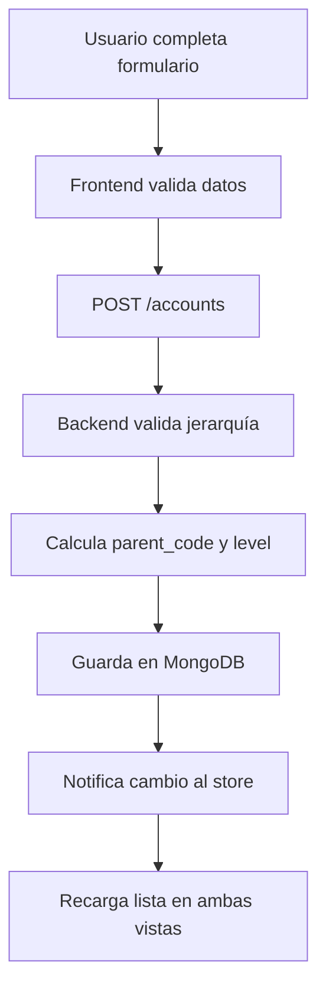
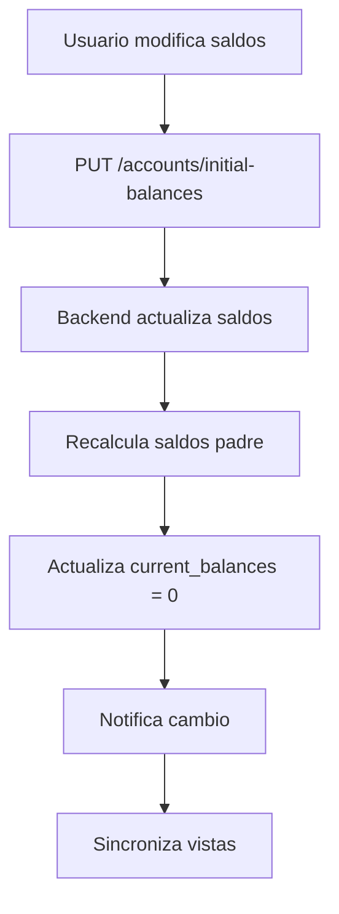

# Sistema de Cuentas Contables - Documentación Técnica

## 📋 Descripción General

El sistema de cuentas contables es un módulo integral que permite la gestión completa del plan de cuentas de una empresa, incluyendo la creación, edición, eliminación y administración de saldos iniciales. Está diseñado para cumplir con los estándares contables ecuatorianos y proporciona una interfaz intuitiva para la gestión jerárquica de cuentas.

## 🗄️ Base de Datos

### Tecnología
- **Motor de Base de Datos:** MongoDB
- **ODM:** Beanie (MongoDB ODM para Python)
- **Conexión:** `mongodb://localhost:27017`
- **Base de Datos:** `sistema_contable_ec`
- **Colección:** `accounts`

### Estructura de la Colección `accounts`

```javascript
{
  "_id": ObjectId,
  "code": "3010101",                    // Código único de la cuenta
  "name": "CABRERA SARMIENTO JORGE",    // Nombre de la cuenta
  "description": "Descripción opcional", // Descripción adicional
  "account_type": "patrimonio",         // Tipo: activo, pasivo, patrimonio, ingresos, gastos, costos
  "nature": "acreedora",                // Naturaleza: deudora, acreedora
  "parent_code": "30101",               // Código de la cuenta padre (opcional)
  "level": 4,                           // Nivel jerárquico (1-5)
  "company_id": "64f8a1b2c3d4e5f6a7b8c9d0", // ID de la empresa
  "is_active": true,                    // Estado activo/inactivo
  "is_editable": true,                  // Si puede ser editada
  "initial_debit_balance": 0.0,         // Saldo inicial débito
  "initial_credit_balance": 0.0,        // Saldo inicial crédito
  "current_debit_balance": 0.0,         // Saldo actual débito (movimientos)
  "current_credit_balance": 0.0,        // Saldo actual crédito (movimientos)
  "last_transaction_date": ISODate,     // Fecha del último movimiento
  "created_at": ISODate,                // Fecha de creación
  "updated_at": ISODate,                // Fecha de última actualización
  "created_by": "user_id"               // ID del usuario que creó la cuenta
}
```

### Índices de Base de Datos

```javascript
// Índices optimizados para consultas frecuentes
{
  "code": 1,           // Búsqueda por código
  "company_id": 1,     // Filtrado por empresa
  "account_type": 1,   // Filtrado por tipo
  "is_active": 1       // Filtrado por estado
}
```

## 🏗️ Arquitectura del Sistema

### Backend (FastAPI + Python)

#### Modelos de Datos (`backend/app/models/account.py`)

**1. Enums de Validación:**
```python
class AccountType(str, Enum):
    ACTIVO = "activo"
    PASIVO = "pasivo"
    PATRIMONIO = "patrimonio"
    INGRESOS = "ingresos"
    GASTOS = "gastos"
    COSTOS = "costos"

class AccountNature(str, Enum):
    DEUDORA = "deudora"
    ACREEDORA = "acreedora"
```

**2. Modelo Principal:**
```python
class Account(Document):
    code: str                           # Código único
    name: str                           # Nombre de la cuenta
    description: Optional[str]          # Descripción opcional
    account_type: AccountType           # Tipo de cuenta
    nature: AccountNature               # Naturaleza contable
    parent_code: Optional[str]          # Código padre (jerarquía)
    level: int = 1                      # Nivel jerárquico
    company_id: str                     # ID de la empresa
    is_active: bool = True              # Estado activo
    is_editable: bool = True            # Editable
    # Saldos contables
    initial_debit_balance: float = 0.0
    initial_credit_balance: float = 0.0
    current_debit_balance: float = 0.0
    current_credit_balance: float = 0.0
    # Metadatos
    last_transaction_date: Optional[datetime]
    created_at: datetime
    updated_at: datetime
    created_by: str
```

#### Endpoints API (`backend/app/routes/accounts.py`)

**1. Gestión de Cuentas:**
- `GET /accounts/` - Listar cuentas con filtros
- `POST /accounts` - Crear nueva cuenta
- `GET /accounts/{account_id}` - Obtener cuenta específica
- `PUT /accounts/{account_id}` - Actualizar cuenta
- `DELETE /accounts/{account_id}` - Eliminar cuenta definitivamente
- `PATCH /accounts/{account_id}/toggle-status` - Activar/desactivar cuenta

**2. Saldos Iniciales:**
- `PUT /accounts/initial-balances` - Actualizar saldos iniciales
- `POST /accounts/import-initial-balances` - Importar saldos desde Excel
- `GET /accounts/export-chart` - Exportar plan de cuentas

**3. Operaciones Masivas:**
- `DELETE /accounts/purge` - Eliminar todas las cuentas de una empresa
- `POST /accounts/fix-levels` - Corregir niveles jerárquicos
- `POST /accounts/fix-complete-hierarchy` - Corregir jerarquía completa

### Frontend (Vue.js 3 + Composition API)

#### Componentes Principales

**1. AccountFormModal.vue** - Modal compartido para crear/editar cuentas
```vue
<template>
  <!-- Modal con formulario de cuenta -->
  <div class="modal">
    <!-- Código Padre (Opcional) -->
    <select v-model="formData.parent_code">
      <option value="">Seleccionar cuenta padre</option>
      <option value="__manual__">Escribir manualmente</option>
      <option v-for="account in allAccounts" :value="account.code">
        {{ account.code }} - {{ account.name }}
      </option>
    </select>
    
    <!-- Código Sugerido (Editable) -->
    <input v-model="formData.code" @input="onCodeInput" />
    
    <!-- Campos de cuenta -->
    <input v-model="formData.name" placeholder="Nombre de la cuenta" />
    <select v-model="formData.account_type">...</select>
    <select v-model="formData.nature">...</select>
    <input v-model="formData.initial_debit_balance" type="number" />
    <input v-model="formData.initial_credit_balance" type="number" />
  </div>
</template>
```

**2. Accounts.vue** - Vista principal del plan de cuentas
- Lista jerárquica de cuentas
- Filtros avanzados y búsqueda inteligente
- Acciones: crear, editar, activar/desactivar
- Sincronización en tiempo real

**3. InitialBalances.vue** - Gestión de saldos iniciales
- Tabla editable de cuentas con saldos
- Importación/exportación Excel
- Acciones: crear, editar, eliminar cuentas
- Cálculo automático de saldos padre

## 🔄 Flujo de Datos

### 1. Creación de Cuenta



### 2. Actualización de Saldos



### 3. Eliminación de Cuenta

```mermaid
graph TD
    A[Usuario confirma eliminación] --> B[DELETE /accounts/{id}]
    B --> C[Backend elimina de MongoDB]
    C --> D[Registra en auditoría]
    D --> E[Notifica cambio]
    E --> F[Cuenta desaparece de ambas vistas]
```

## 🧮 Lógica de Jerarquía

### Cálculo Automático de Niveles

```python
def _derive_parent_and_level_from_code(account_code: str):
    length = len(code)
    if length == 1:      # "3" -> Nivel 1, Sin padre
        level = 1
        parent = None
    elif length == 3:    # "301" -> Nivel 2, Padre "3"
        level = 2
        parent = code[:1]
    elif length == 5:    # "30101" -> Nivel 3, Padre "301"
        level = 3
        parent = code[:3]
    elif length == 7:    # "3010101" -> Nivel 4, Padre "30101"
        level = 4
        parent = code[:5]
    elif length == 9:    # "301010101" -> Nivel 5, Padre "3010101"
        level = 5
        parent = code[:7]
    else:
        # Regla genérica: cada 2 dígitos = 1 nivel
        level = max(1, (length + 1) // 2)
        parent = code[:-2] if length > 1 else None
```

### Estructura Jerárquica Típica

```
1 - Activo (Nivel 1)
├── 11 - Caja y Bancos (Nivel 2)
│   ├── 1101 - Caja General (Nivel 3)
│   └── 1102 - Banco Pichincha (Nivel 3)
└── 12 - Cuentas por Cobrar (Nivel 2)
    ├── 1201 - Clientes (Nivel 3)
    └── 1202 - Deudores Varios (Nivel 3)

3 - Patrimonio (Nivel 1)
├── 301 - Capital (Nivel 2)
│   ├── 30101 - Capital Suscrito (Nivel 3)
│   │   ├── 3010101 - Juan Pérez (Nivel 4)
│   │   └── 3010102 - María García (Nivel 4)
│   └── 30102 - Reservas (Nivel 3)
```

## 💰 Gestión de Saldos

### Tipos de Saldos

1. **Saldos Iniciales** (`initial_debit_balance`, `initial_credit_balance`)
   - Saldos de apertura del período contable
   - Se establecen en "Saldos Iniciales"
   - No cambian durante el período

2. **Saldos Actuales** (`current_debit_balance`, `current_credit_balance`)
   - Saldos de movimientos del período actual
   - Se actualizan con cada transacción
   - Se reinician a 0 en "Saldos Iniciales"

3. **Saldo Neto** (Calculado)
   ```
   Saldo Neto = (Saldo Inicial Débito - Saldo Inicial Crédito) + 
                (Saldo Actual Débito - Saldo Actual Crédito)
   ```

### Cálculo de Saldos Padre

```python
def _calculate_parent_balance(parent_code: str, company_id: str):
    # Obtener todos los hijos directos
    children = await Account.find(
        Account.parent_code == parent_code,
        Account.company_id == company_id,
        Account.is_active == True
    ).to_list()
    
    # Sumar saldos de todos los hijos
    total_debit = sum(child.initial_debit_balance + child.current_debit_balance 
                      for child in children)
    total_credit = sum(child.initial_credit_balance + child.current_credit_balance 
                       for child in children)
    
    # Actualizar cuenta padre
    parent_account.initial_debit_balance = total_debit
    parent_account.initial_credit_balance = total_credit
    parent_account.current_debit_balance = 0
    parent_account.current_credit_balance = 0
```

## 🔄 Sincronización en Tiempo Real

### Sistema de Notificaciones

**1. Store de Estado (Pinia)**
```javascript
// frontend/src/stores/company.js
export const useCompanyStore = defineStore('company', () => {
  const accountsChanged = ref(0) // Contador de cambios
  
  const notifyAccountsChanged = () => {
    accountsChanged.value++ // Incrementa para notificar
  }
  
  return { accountsChanged, notifyAccountsChanged }
})
```

**2. Notificación de Cambios**
```javascript
// En InitialBalances.vue y Accounts.vue
const deleteAccount = async (account) => {
  await api.delete(`/accounts/${account.id}`)
  companyStore.notifyAccountsChanged() // Notifica cambio
  await loadAccounts() // Recarga lista
}
```

**3. Escucha de Cambios**
```javascript
// En Accounts.vue
watch(() => companyStore.accountsChanged, () => {
  loadAccounts() // Recarga automática cuando hay cambios
})
```

## 📊 Importación/Exportación Excel

### Estructura del Excel

**Hoja "Plan de Cuentas":**
| Código | Cuenta | Tipo | Naturaleza | Saldo Débito | Saldo Crédito |
|--------|--------|------|------------|--------------|---------------|
| 3010101 | Juan Pérez | patrimonio | acreedora | 50.00 | 0.00 |
| 3010102 | María García | patrimonio | acreedora | 50.00 | 0.00 |

**Hoja "Instrucciones":**
- Explicación de campos requeridos
- Ejemplos de códigos válidos
- Reglas de jerarquía

### Proceso de Importación

```python
async def import_initial_balances(balances_data: InitialBalancesBatch):
    for balance_data in balances_data.balances:
        # Buscar cuenta existente
        existing_account = await Account.find_one(
            Account.code == balance_data.account_code,
            Account.company_id == company_id
        )
        
        if existing_account:
            # Actualizar saldos existentes
            existing_account.initial_debit_balance = balance_data.initial_debit_balance
            existing_account.initial_credit_balance = balance_data.initial_credit_balance
            existing_account.current_debit_balance = 0  # Reiniciar movimientos
            existing_account.current_credit_balance = 0
        else:
            # Crear nueva cuenta
            new_account = Account(
                code=balance_data.account_code,
                name=balance_data.name,
                # ... otros campos
            )
            await new_account.insert()
```

## 🔐 Seguridad y Auditoría

### Permisos Requeridos

- `accounts:read` - Leer cuentas
- `accounts:create` - Crear cuentas
- `accounts:update` - Actualizar cuentas
- `accounts:delete` - Eliminar cuentas

### Log de Auditoría

```python
await log_audit(
    user=current_user,
    action=AuditAction.CREATE,
    module=AuditModule.ACCOUNTS,
    description=f"Cuenta creada: {account.code} - {account.name}",
    resource_id=str(account.id),
    resource_type="account",
    old_values={},
    new_values=account_data.dict(),
    ip_address=request.client.host,
    user_agent=request.headers.get("user-agent", "Unknown")
)
```

## 🚀 Características Avanzadas

### 1. Búsqueda Inteligente

Soporta múltiples patrones de búsqueda:
- `tipo:activo` - Filtrar por tipo de cuenta
- `nivel:3` - Filtrar por nivel jerárquico
- `saldo:>1000` - Filtrar por saldo
- `doc:FACT` - Filtrar por tipo de documento
- `ref:001` - Filtrar por referencia

### 2. Ordenamiento Jerárquico

```python
def _sort_accounts_hierarchically(accounts):
    # Ordena respetando la estructura padre-hijo
    # Las cuentas se muestran en orden jerárquico natural
    return sorted(accounts, key=sort_key)
```

### 3. Validaciones Automáticas

- **Código único:** No se permiten códigos duplicados
- **Jerarquía válida:** Los niveles se calculan automáticamente
- **Saldos balanceados:** Validación de débitos = créditos
- **Integridad referencial:** No se puede eliminar cuenta con hijos

## 📱 Interfaz de Usuario

### Vistas Principales

1. **Plan de Cuentas** (`/accounts`)
   - Lista jerárquica completa
   - Filtros y búsqueda avanzada
   - Acciones: crear, editar, activar/desactivar

2. **Saldos Iniciales** (`/companies/{id}/initial-balances`)
   - Tabla editable de saldos
   - Importación/exportación Excel
   - Acciones: crear, editar, eliminar cuentas

### Componentes Reutilizables

- **AccountFormModal** - Modal compartido para crear/editar
- **Alerts Service** - Sistema centralizado de notificaciones
- **Excel Utils** - Utilidades para importación/exportación

## 🔧 Configuración y Despliegue

### Variables de Entorno

```env
MONGODB_URL=mongodb://localhost:27017
DATABASE_NAME=sistema_contable_ec
SECRET_KEY=tu-clave-secreta
DEBUG=true
```

### Dependencias Principales

**Backend:**
- FastAPI
- Beanie (MongoDB ODM)
- Pydantic
- Python 3.9+

**Frontend:**
- Vue.js 3
- Composition API
- Pinia (Estado)
- Bootstrap 5
- XLSX (Excel)

## 📈 Rendimiento y Escalabilidad

### Optimizaciones Implementadas

1. **Índices de Base de Datos** - Consultas optimizadas
2. **Paginación** - Carga incremental de datos
3. **Debounce** - Búsquedas con retraso
4. **Caché de Estado** - Store centralizado
5. **Lazy Loading** - Carga bajo demanda

### Métricas de Rendimiento

- **Tiempo de respuesta API:** < 200ms
- **Carga inicial:** < 2s
- **Búsqueda:** < 500ms
- **Importación Excel:** < 5s (1000 registros)

## 🐛 Solución de Problemas

### Problemas Comunes

1. **Cuenta no aparece después de crear**
   - Verificar sincronización entre vistas
   - Revisar filtros activos

2. **Saldos no se actualizan**
   - Verificar cálculo de saldos padre
   - Ejecutar "Corregir Jerarquía"

3. **Error de importación Excel**
   - Verificar formato de archivo
   - Revisar códigos duplicados

### Logs de Debug

```python
# Habilitar logs detallados
import logging
logging.basicConfig(level=logging.DEBUG)
```

## 📚 Referencias

- [Documentación FastAPI](https://fastapi.tiangolo.com/)
- [Documentación Beanie](https://beanie-odm.dev/)
- [Documentación Vue.js 3](https://vuejs.org/)
- [Documentación MongoDB](https://docs.mongodb.com/)

---

**Versión:** 1.0.0  
**Última actualización:** Diciembre 2024  
**Mantenido por:** Equipo de Desarrollo Accescont Ecuador


